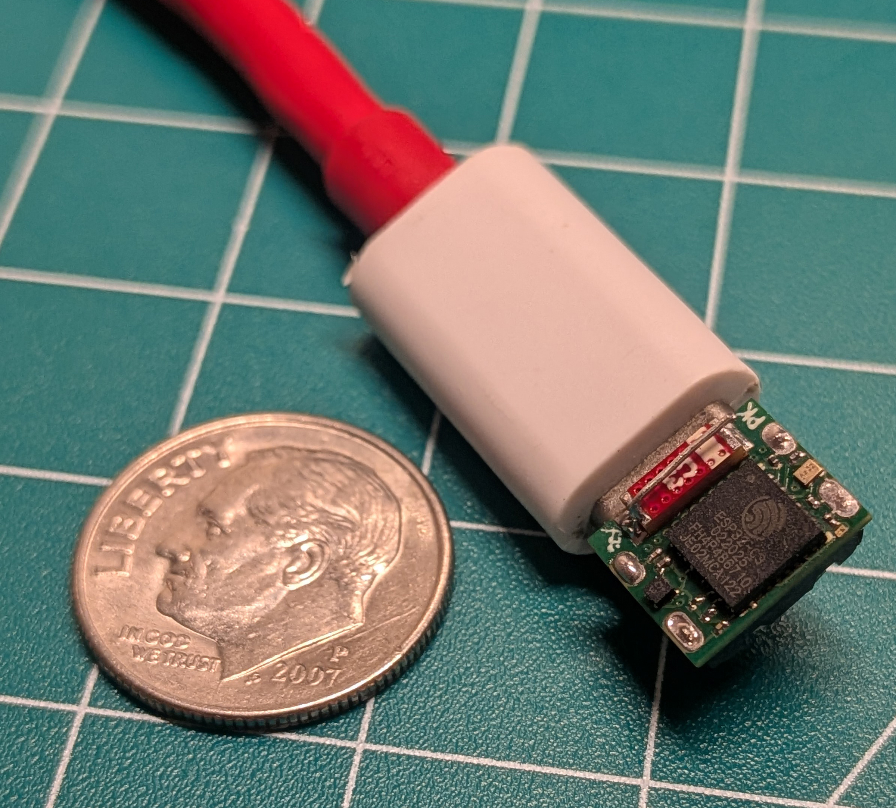
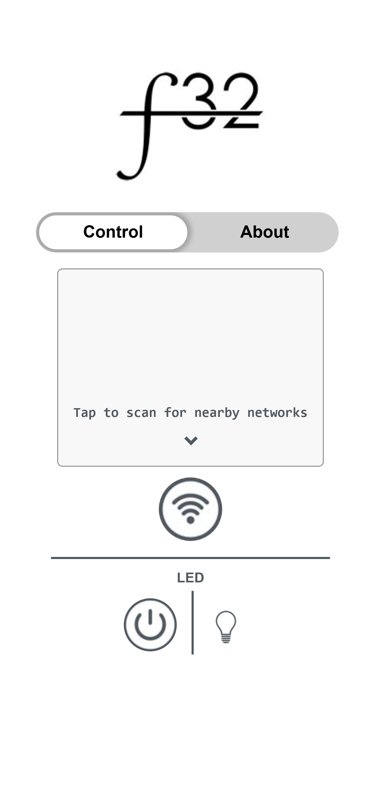
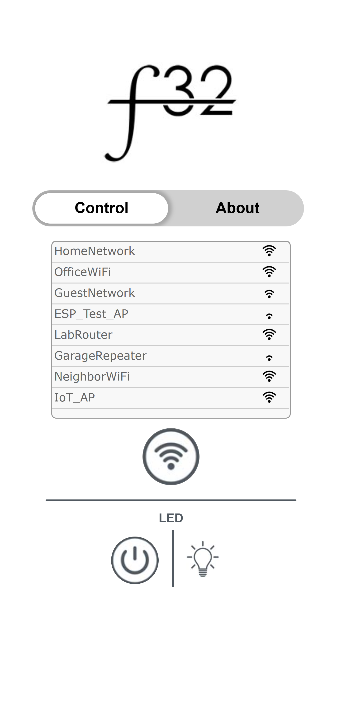
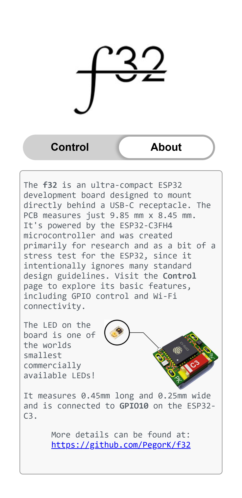
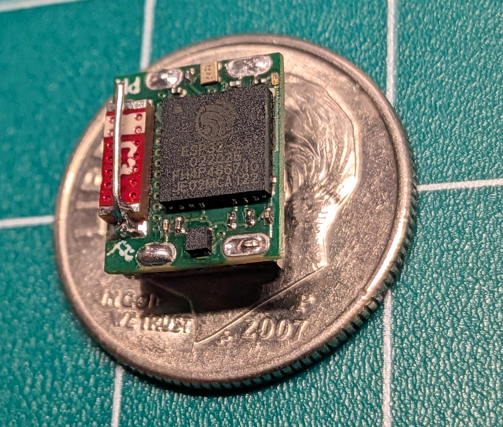
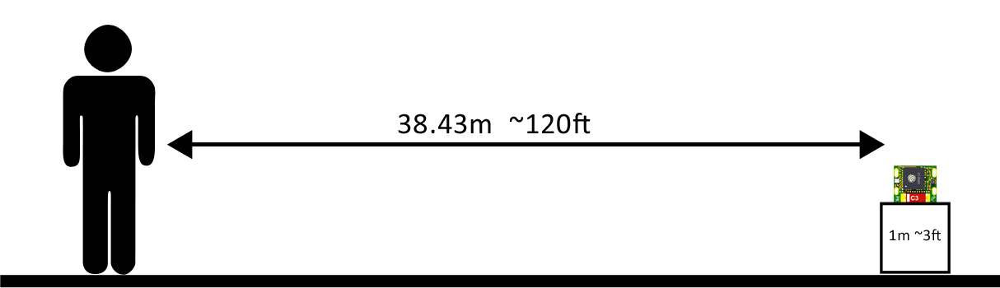
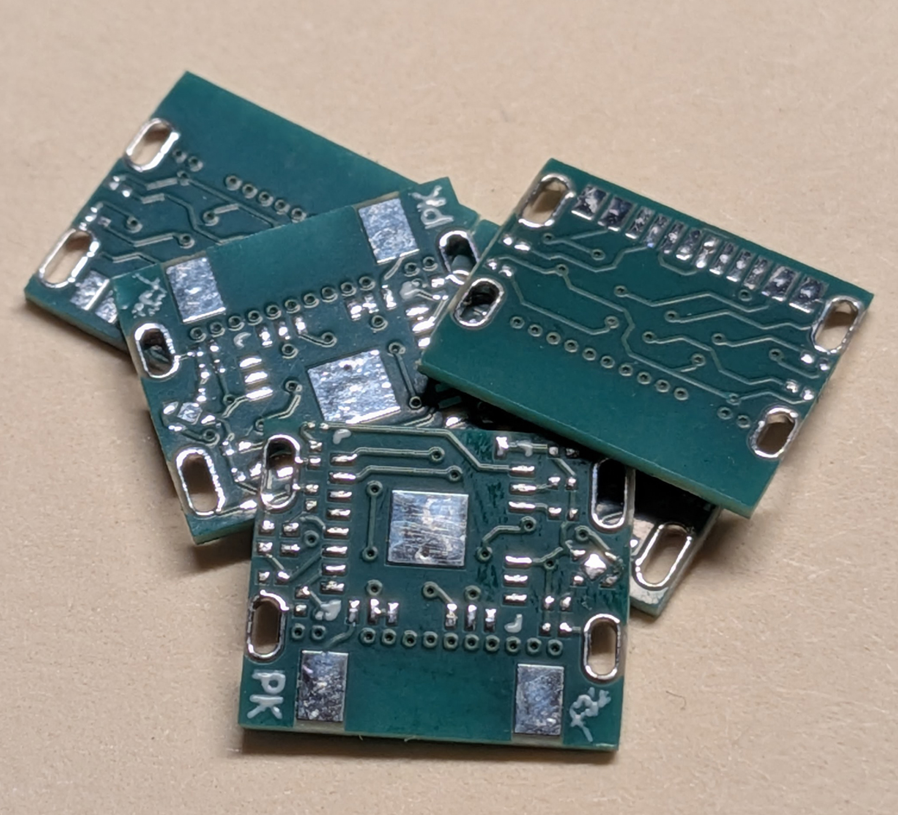

<div align="center">
    <table>
        <tr>
            <td>
                <div align="center">
                    
                </div>
            </td>
            <td>
                <div align="center">
                    
                </div>
            </td>
        </tr>
    </table>
</div>

The <b>f32</b> is an ultra-compact ESP32 development board designed to mount directly behind a USB-C receptacle. The PCB measures just 9.85 mm x 8.45 mm. It's powered by the ESP32-C3FH4 microcontroller and was created primarily for research and as a bit of a stress test for the ESP32, since it intentionally ignores many standard design guidelines. There's only one exposed GPIO and it is connected to an onboard LED, so most of the development on here would be more catered for wifi/web.<br>
<div align="center">
  
</div>
To test the f32 an example application was created that users can interact with. The application turns the f32 into a captive portal so when the it's is powered on it will show up as an open access point that the user can select from available WiFi networks. The user is then automatically sent to the f32's control page where they can interact with some of its basic functionality such as turning on an LED or scanning for surrounding WiFi networks. There's also an "About" page that provides a small overview of the device.<br>
Below are some screenshots of interacting with the device.
<div align="center">
    <table>
        <tr>
            <td>
                <div align="center">
                    
                    <br> Main page of the captive portal.
                </div>
            </td>
            <td>
                <div align="center">
                    
                    <br> WiFi list after a search and LED toggled on.
                </div>
            </td>
            <td>
                <div align="center">
                    
                    <br> About page.
                </div>
            </td>
        </tr>
    </table>
</div>

Initially the f32 didn't seem to want to work. I couldn't get it to connect to any networks or broadcast it's own network. Im 100% sure this is due to the poor antenna circuitry or lack of, but I did manage to get it functional after adding an additional tiny antenna onto the chip antenna as seen in the picture below. This was just a piece of bent wire soldered to the end lead and floating above the first lead.

<div align="center">
    
</div>

Since I don't have fancy signal testing equipment I relied on some manually testing such as seeing if I can still connect to the device and control the LED. In a clear line of sight test with the f32 placed about 3ft off the ground I was able to connect to the f32 and perform scans/control the LED at roughly 120ft! This can be seen in my highly necessary depiction below.

<div align="center">
    
</div>

## Building the f32

The PCB was designed using DipTrace and manufactured by [PCBWay](https://www.pcbway.com/) with a board thickness of 0.6mm, min hole size of 0.2mm, and min track/spacing of 4/4mil. At the time of making this it only cost $10.75 for 5 boards shipped! That still blows my mind. PCBWay does also offer assembly services, but I chose to assemble this at home and suffer a bit. This took a bit of trial and error with such small parts, but I decided the best way for me was to ditch the stencil and make flux my best friend.
<br><br>

Tools & parts used:
- [SRA Solder 135 Rosin Paste Soldering Flux](https://a.co/d/bhX7DBc)
- [Thin Kester Solder 63/37](https://a.co/d/fMBzUdM)
- [Pinecil Soldering Iron](https://a.co/d/itmbdTI)
- [Fine Soldering Iron Tip](https://a.co/d/csG1oAx)
- [Rework Station](https://a.co/d/5dLKwJ0)
- [Soldering Hotplate](https://a.co/d/gqigFIM)
- Digital Microscope or Jewelers Loupe
- Fine Tip Tweezer (DON'T cheap out on tweezers! A good tweezer is a game changer)
<br>

Steps to building one:

 - Send the gerber file `f32_gerber.zip` found in the `hardware` folder to PCBWay with the specs mentioned above.
 - Order the components noted in `f32_bom.pdf`. These parts can be found on both DigiKey and Mouser.
    - <i>** Tip: Always order more than you need, especially with components as small as these.</i>
 - Clean the pcb really well with 99% Alcohol.
 - Starting with the top side (Antenna side) apply a thin layer of soldering flux across the entire board using a tooth pick.
 - Using a soldering iron with a fine tip apply some solder to the tip and then go across all the exposed pads. 
 - Clean the board again with 99% alcohol and verify all the pads on this side have some solder on them.
 - Apply another thin layer of flux to the same side.
 - Using tweezers and a microscope/loupe start placing the top components following the reference guide `f32_reference.pdf`.
    -  <i>** Tip: I found placing the larger components last helps.</i>
 - Gently move the board onto the soldering hotplate or use the rework station to heat the solder back up and watch the components wiggle into place.
 - Repeat with Bottom side.
    - Bottom side must be done using a rework hot air gun, not possible with hotplate.
    - Place the USB-C receptacle last.
- Clean entire board using alcohol and a fine toothbrush.

## Flashing the f32

After assembly you can use ESP-IDF VSCode extension or Arduino and upload whatever you'd like to the board or you can upload my example application using the steps below.

- Make sure you are in the base directory of this repo and have access to `esptool.py`. 
- Run the following command replacing `<PORT>` with whichever port the device is connected to i.e. on Windows typically something like `COM5` or on Linux `/dev/ttyACM0`
```
esptool.py -p <PORT> -b 460800 --before default_reset --after hard_reset --chip esp32c3 write_flash --flash_mode dio --flash_freq 80m --flash_size 2MB 0x0 firmware/bootloader.bin 0x10000 firmware/f32_internal.bin 0x8000 firmware/partition-table.bin 
```

## Future Ideas
- Expose more GPIOs on the sides of the PCB to make it a mountable PCB.
- Improve antenna circuitry.


Lastly, fun coincidence, the ESP32 chip, the antenna, and the LDO all are "C3" models!